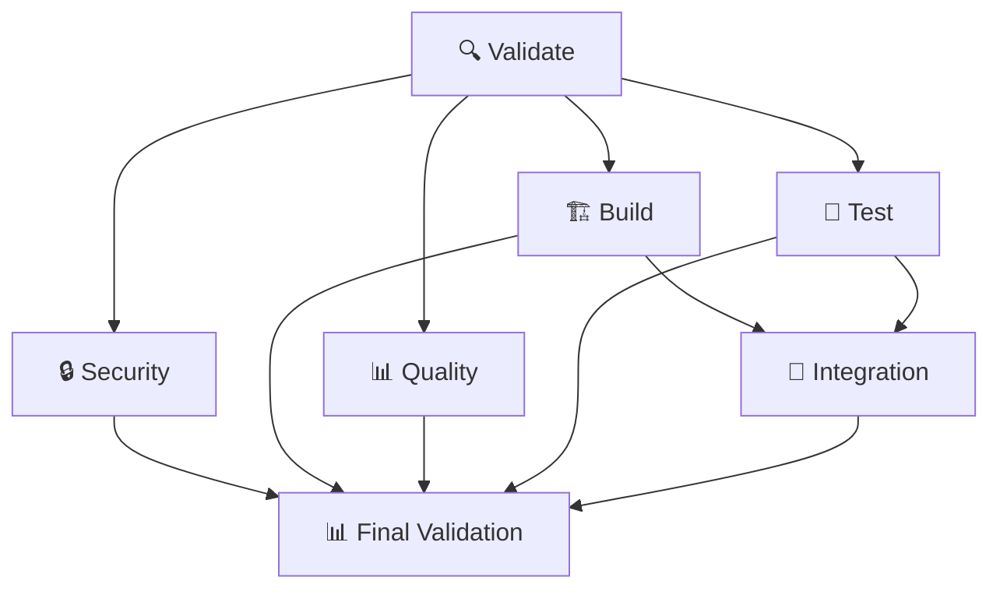

# 🔥 CI/CD Pipeline Documentation

## Overview

This document describes the comprehensive CI/CD pipeline implemented for the template-arch-lint Go application. The pipeline provides enterprise-grade automation with security, quality, and testing enforcement.

## 🏗️ Pipeline Structure

### Available Workflows

1. **ci.yml** - Complete CI/CD pipeline (with architecture linting)
2. **ci-working.yml** - Working CI/CD pipeline (architecture linting disabled temporarily)
3. **env.yml** - Shared environment configuration

### Pipeline Jobs



## 📋 Job Details

### 🔍 Validate Job
**Purpose**: Basic validation and setup
**Timeout**: 5 minutes
**Actions**:
- Checkout code with full history
- Setup Go environment with caching
- Verify and tidy dependencies
- Check for problematic filenames

### 🔒 Security Job
**Purpose**: Security scanning and analysis
**Timeout**: 10 minutes
**Actions**:
- CodeQL security analysis
- Trivy vulnerability scanning
- SARIF report generation
- Security alerts integration

### 🏗️ Build Job
**Purpose**: Build verification and artifact generation
**Timeout**: 10 minutes
**Actions**:
- Generate templ templates
- Build Go application
- Create server binary
- Upload build artifacts

### 📊 Quality Job
**Purpose**: Code quality enforcement
**Timeout**: 15 minutes
**Actions**:
- Run golangci-lint with strict configuration
- Generate lint reports (XML, JSON)
- Upload quality artifacts
- Enforce quality gates

### 🧪 Test Job
**Purpose**: Comprehensive testing with coverage
**Timeout**: 15 minutes
**Matrix**: Go 1.24.0, 1.23.0
**Actions**:
- Run all tests with race detection
- Generate coverage reports
- Upload to Codecov
- Create coverage artifacts

### 🔧 Integration Job
**Purpose**: Integration and configuration testing
**Timeout**: 10 minutes
**Dependencies**: Build + Test jobs
**Actions**:
- Run integration test suite
- Test configuration system
- Validate server startup

### 📊 Final Validation Job
**Purpose**: Pipeline summary and final checks
**Timeout**: 5 minutes
**Actions**:
- Generate pipeline summary
- Validate all job results
- Create deployment readiness report

## ⚙️ Configuration

### Environment Variables

```yaml
GO_VERSION: '1.24.0'
GOLANGCI_LINT_VERSION: 'v2.3.1'
GO_ARCH_LINT_VERSION: 'v1.12.0'
```

### Required Permissions

```yaml
permissions:
  contents: read
  security-events: write
  pull-requests: write
  checks: write
```

### Timeouts

- Validate: 5 minutes
- Security: 10 minutes
- Build: 10 minutes
- Quality: 15 minutes
- Test: 15 minutes
- Integration: 10 minutes
- Final Validation: 5 minutes

## 🔧 Tools Integration

### Code Quality Tools

1. **golangci-lint** - Comprehensive Go linting
   - Configuration: `.golangci.yml`
   - Strictness: Maximum (enterprise-grade)
   - Output: Colored console + XML reports

2. **go-arch-lint** - Architecture validation
   - Configuration: `.go-arch-lint.yml`
   - Status: Temporarily disabled due to import issues
   - Purpose: Enforce clean architecture boundaries

### Security Tools

1. **CodeQL** - Static security analysis
   - Languages: Go
   - Queries: Security and quality focused
   - Integration: GitHub Security tab

2. **Trivy** - Vulnerability scanning
   - Scope: Filesystem scanning
   - Severity: CRITICAL, HIGH, MEDIUM
   - Output: SARIF format

### Testing Tools

1. **Go Test** - Native Go testing
   - Race detection enabled
   - Coverage reporting
   - Timeout: 10 minutes

2. **Ginkgo/Gomega** - BDD testing framework
   - Used for domain and handler tests
   - Rich assertion library

## 📊 Quality Gates

### Coverage Requirements
- Minimum coverage: 80% (configurable)
- Race condition detection: Enabled
- Timeout protection: 10 minutes

### Code Quality Metrics
- Cyclomatic complexity: Max 10
- Function length: Max 50 lines
- Zero tolerance for security issues

### Security Requirements
- No high/critical vulnerabilities
- CodeQL security checks pass
- Dependency security verified

## 🚨 Current Issues

### Architecture Linting
**Status**: Disabled in ci-working.yml
**Issue**: go-arch-lint import resolution error
**Error**: `package without types was imported`
**Workaround**: Use ci-working.yml until resolved

### Resolution Steps
1. Fix import cycles in container package
2. Update architecture configuration
3. Re-enable architecture linting
4. Switch back to ci.yml

## 📈 Monitoring & Reporting

### Artifacts Generated
- Build binaries (1 day retention)
- Test coverage reports (30 days)
- Lint results (30 days)
- Security scan results (90 days)

### Integration Points
- Codecov for coverage tracking
- GitHub Security for vulnerability alerts
- PR checks for quality gates
- GitHub Actions for workflow status

## 🔄 Automation Features

### Dependabot Integration
- Weekly dependency updates
- Automatic PR creation
- Security vulnerability alerts
- Version grouping for minor/patch updates

### Code Owners
- Automatic review assignments
- Protected file patterns
- CI/CD configuration protection

## 🚀 Usage

### Running Locally
```bash
# Full CI simulation
just ci

# Individual components
just lint      # Code quality
just test      # Test suite
just build     # Build verification
```

### GitHub Integration
- Push to main/master/develop triggers full pipeline
- Pull requests run complete validation
- Manual workflow dispatch available

### Status Monitoring
- GitHub Actions tab for workflow status
- PR checks for quality gates
- Security tab for vulnerability reports
- Codecov for coverage trends

## 🔧 Troubleshooting

### Common Issues

1. **Build Failures**
   - Check Go version compatibility
   - Verify dependency availability
   - Ensure templates are generated

2. **Test Failures**
   - Check for race conditions
   - Verify test database setup
   - Review timeout settings

3. **Quality Failures**
   - Review golangci-lint output
   - Check complexity metrics
   - Address security issues

4. **Integration Failures**
   - Verify server startup
   - Check configuration validity
   - Review artifact availability

### Debug Steps
1. Check workflow logs in GitHub Actions
2. Review specific job outputs
3. Download artifacts for local analysis
4. Run equivalent commands locally

## 🎯 Future Improvements

### Planned Enhancements
- Fix architecture linting integration
- Add deployment automation
- Implement performance testing
- Add multi-environment support

### Optimization Opportunities
- Parallel job execution
- Smarter caching strategies
- Faster security scanning
- Improved artifact management

## 📞 Support

For issues with the CI/CD pipeline:
1. Check this documentation
2. Review GitHub Actions logs
3. Test commands locally using justfile
4. Contact the development team

---

**Last Updated**: August 12, 2025
**Pipeline Version**: 1.0.0
**Status**: Working (with temporary architecture linting disabled)