# 📊 GitHub Issues Execution Strategy - Mermaid Graph

## 🎯 Complete Execution Plan for All Open Issues

```mermaid
graph TD
    A[Issue #8: CRITICAL Security & Integration] --> B{Security Resolved?}
    B -->|Yes| C[Issue #10: Tool Version Fix]
    B -->|No| D[BLOCKED - Fix Security First]
    
    C --> E[Issue #2: Foundation 75% → 100%]
    E --> F[Issue #3: Architecture 60% → 100%]
    F --> G[Issue #4: Web & API 70% → 100%]
    G --> H[Issue #5: Data & Config 50% → 100%]
    
    H --> I[Issue #6: CI/CD & Deployment]
    
    C --> J[Issue #9: Architecture Decision Record]
    J --> K[Issue #11: Daily Work Summary]
    
    I --> L[Template Ready for Production]
    K --> L

    style A fill:#ff6b6b,stroke:#fff,stroke-width:3px
    style B fill:#ffd93d,stroke:#fff,stroke-width:2px
    style D fill:#ff6b6b,stroke:#fff,stroke-width:2px
    style L fill:#51cf66,stroke:#fff,stroke-width:3px
```

## 🚀 Multi-Stage Execution Strategy

### 🚨 Stage 1: Critical Blockers (MUST COMPLETE FIRST)
**Estimated: 4-6 hours**

#### Issue #8: Security Vulnerability and Integration Testing ✅ RESOLVED
- [x] **Security Status**: Verified resolved via GitHub API
- [x] **Code Quality**: 156 issues analyzed by severity
- [x] **Integration Testing**: Git subtree workflow verified
- **Status**: COMPLETE - No longer blocking

#### Issue #10: Tool Version Inconsistencies
- **Scope**: Fix tool version mismatches in main justfile
- **Effort**: 30 minutes  
- **Dependencies**: None
- **Deliverables**: Synchronized tool versions across all files

### 🏗️ Stage 2: Foundation Completion (Build on Existing Progress)
**Estimated: 8-12 hours**

#### Issue #2: Foundation (75% → 100%)
- **Current State**: Dependency injection, error handling, testing infrastructure
- **Missing**: Enhanced testing patterns, performance benchmarks
- **Effort**: 2-3 hours
- **Dependencies**: Issue #10

#### Issue #3: Architecture (60% → 100%)  
- **Current State**: Clean architecture layers, repository patterns
- **Missing**: Advanced domain patterns, event sourcing setup
- **Effort**: 3-4 hours
- **Dependencies**: Issue #2

#### Issue #4: Web & API (70% → 100%)
- **Current State**: Gin server, basic handlers, middleware
- **Missing**: Advanced API patterns, OpenAPI docs, rate limiting
- **Effort**: 2-3 hours  
- **Dependencies**: Issue #3

#### Issue #5: Data & Config (50% → 100%)
- **Current State**: Basic configuration management
- **Missing**: Database migrations, observability, advanced config patterns
- **Effort**: 3-4 hours
- **Dependencies**: Issue #4

### 🚀 Stage 3: Production Readiness
**Estimated: 6-8 hours**

#### Issue #6: CI/CD & Deployment (5% → 100%)
- **Current State**: Basic GitHub Actions
- **Missing**: Complete CI/CD pipeline, containerization, deployment automation
- **Effort**: 6-8 hours
- **Dependencies**: Issues #2-#5 complete

### 📝 Stage 4: Documentation & Governance
**Estimated: 2-3 hours**

#### Issue #9: Architecture Decision Record
- **Scope**: Document template-justfile integration strategy
- **Effort**: 1-2 hours
- **Dependencies**: Issue #10
- **Deliverables**: Complete ADR with implementation details

#### Issue #11: Daily Work Summary  
- **Scope**: Status tracking and progress documentation
- **Effort**: 30 minutes ongoing
- **Dependencies**: All other issues
- **Deliverables**: Regular progress updates

## 🎯 Execution Priorities & Dependencies

### Critical Path Analysis

## 📊 Resource Allocation & Risk Assessment

### High-Value, Low-Risk Issues
1. **Issue #10** - Tool version fix (30 min, no dependencies)
2. **Issue #9** - ADR documentation (1-2 hours, low complexity)
3. **Issue #11** - Work summary (ongoing, 30 min increments)

### High-Value, Medium-Risk Issues  
1. **Issue #2** - Foundation completion (existing 75% progress)
2. **Issue #4** - Web & API completion (existing 70% progress)
3. **Issue #3** - Architecture completion (existing 60% progress)

### High-Value, High-Risk Issues
1. **Issue #5** - Data & Config (only 50% complete, database complexity)
2. **Issue #6** - CI/CD & Deployment (only 5% complete, infrastructure complexity)

## 🔧 Execution Recommendations

### Parallel Execution Opportunities
- **Issues #9 & #10** can be worked simultaneously (documentation vs. code)
- **Issues #2 & #3** have some parallel work potential (testing vs. domain patterns)

### Sequential Dependencies (Must Follow Order)
1. **Issue #8** → **Issue #10** → **Issue #2** → **Issue #3** → **Issue #4** → **Issue #5** → **Issue #6**
2. **Issue #9** can start after **Issue #10**
3. **Issue #11** runs parallel throughout

### Risk Mitigation Strategies
- **Code Quality**: Address 156 linting issues incrementally per issue
- **Integration Testing**: Verify each component integration before moving forward
- **Documentation**: Keep ADR updated as architectural decisions are made

## 🎯 Success Metrics

### Per-Issue Completion Criteria
- **All tests pass** with new implementations
- **Zero linting violations** for modified code sections  
- **Integration tests verify** component interactions
- **Documentation updated** for new features

### Overall Project Success
- **Template demonstrates enterprise-grade standards** 
- **Zero tolerance for quality violations** actually enforced
- **Real-world usability** proven through testing
- **Complete template-justfile integration** working end-to-end

---

**Graph Generated**: August 11, 2025  
**Total Estimated Effort**: 20-29 hours across 9 issues  
**Critical Path**: Issue #8 → #10 → #2 → #3 → #4 → #5 → #6 (16-22 hours)  
**Parallel Opportunities**: Issues #9, #11 can reduce total timeline by 20%