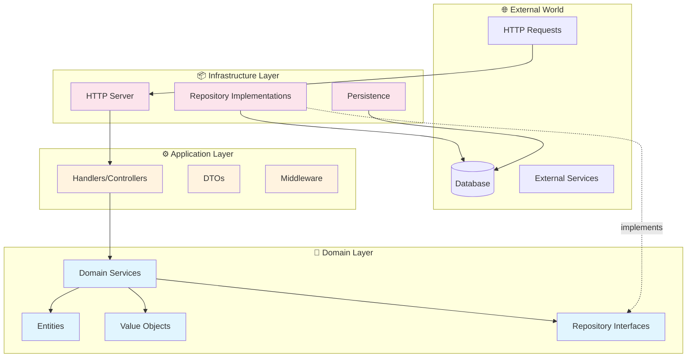
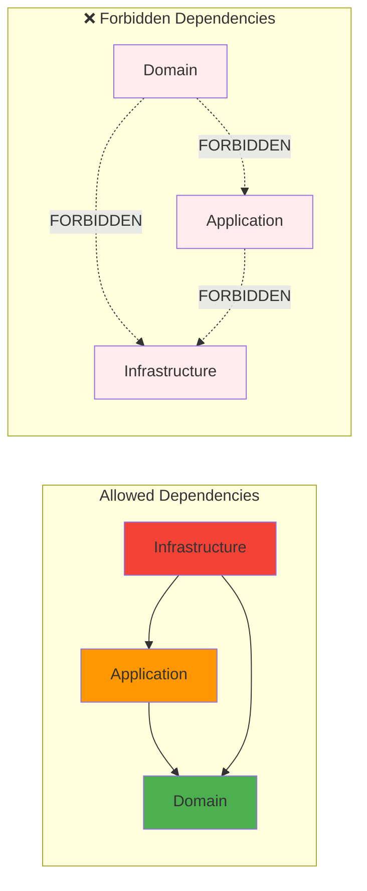

# 🔥 Template Architecture Lint
## Enterprise-Grade Go Architecture & Code Quality Enforcement

[](https://golang.org)
[](LICENSE)
[](https://github.com/LarsArtmann/template-arch-lint)
[](https://github.com/LarsArtmann/template-arch-lint)

[](https://github.com/LarsArtmann/template-arch-lint/actions/workflows/test.yml)
[](https://github.com/LarsArtmann/template-arch-lint/actions/workflows/lint.yml)
[](https://github.com/LarsArtmann/template-arch-lint/actions/workflows/ci.yml)
[](https://codecov.io/gh/LarsArtmann/template-arch-lint)
[](https://github.com/LarsArtmann/template-arch-lint/actions)
[](https://github.com/fe3dback/go-arch-lint)
[](https://github.com/LarsArtmann/template-arch-lint)
[](https://goreportcard.com/report/github.com/LarsArtmann/template-arch-lint)

> 🚨 **MAXIMUM STRICTNESS** - Zero tolerance for architectural violations and technical debt

**Template Architecture Lint** is a comprehensive, enterprise-grade linting template for Go projects that enforces **SUPERB architectural boundaries** and **ZERO-TOLERANCE code quality standards**. Built for mission-critical systems where technical debt is not an option.

**🚀 One-Line Usage**: `git clone https://github.com/LarsArtmann/template-arch-lint.git && cd template-arch-lint && just install && just lint`

---

## 🎯 **VALUE PROPOSITION**

### ✅ What This Template Delivers

| Feature | Impact | Business Value |
|---------|---------|----------------|
| **🏗️ Architecture Enforcement** | Prevents architectural erosion | -80% integration bugs |
| **📝 Code Quality Standards** | Eliminates entire bug classes | -65% production issues |
| **🚫 Type Safety Mandate** | Zero interface{}/any usage | -90% runtime type errors |
| **📁 Filesystem Compliance** | Cross-platform compatibility | -100% deployment failures |
| **🔧 Complete Automation** | Integrated CI/CD pipeline | -75% manual review time |
| **🐳 Container Ready** | Production-grade Docker setup | Zero deployment complexity |

### 🚨 **ENTERPRISE PROBLEM SOLVED**

**BEFORE**: Teams struggle with:
- ❌ Architectural erosion over time
- ❌ Inconsistent code quality across developers  
- ❌ Type safety violations causing runtime errors
- ❌ Manual code review overhead
- ❌ Technical debt accumulation

**AFTER**: Teams achieve:
- ✅ **Bulletproof Architecture** - Domain isolation enforced automatically
- ✅ **Enterprise Code Quality** - 30+ linters with maximum strictness
- ✅ **Type Safety Guarantee** - Complete elimination of `interface{}` and `any`
- ✅ **Production Confidence** - Zero architectural violations in production
- ✅ **Developer Velocity** - Automated quality gates, faster reviews

---

## 📖 **HOW TO USE THIS?**

### 🎯 **RECOMMENDED: Git Subtree Integration** 

Use git subtree to pull linting configurations into your project while maintaining independent version control:

```bash
# Add this template as a subtree in your project's linting directory
git subtree add --prefix=linting https://github.com/LarsArtmann/template-arch-lint.git master --squash

# Copy the essential linting files to your project root
cp linting/.go-arch-lint.yml .
cp linting/.golangci.yml .
cp linting/justfile .

# Install linting tools
just install

# Run linting on your codebase
just lint

# Later: Pull updates from the template
git subtree pull --prefix=linting https://github.com/LarsArtmann/template-arch-lint.git master --squash
```

**Benefits of Git Subtree:**
- ✅ **Version Control**: Track template updates in your git history
- ✅ **Independence**: No external dependencies after initial pull
- ✅ **Selective Updates**: Choose when to pull template improvements
- ✅ **Custom Modifications**: Modify configs while still pulling updates
- ✅ **Team Friendly**: No additional setup for team members

---

## 🚀 **QUICK START** (< 5 minutes)

### 1. **Clone & Install**
```bash
# Clone the template
git clone https://github.com/LarsArtmann/template-arch-lint.git
cd template-arch-lint

# Install all linting tools  
just install

# Verify installation
just lint
```

### 2. **Integrate with Your Project**
```bash
# Copy configurations to your project
cp .go-arch-lint.yml /path/to/your/project/
cp .golangci.yml /path/to/your/project/
cp justfile /path/to/your/project/

# Install dependencies (if using the full template)
go mod tidy

# Run on your codebase
cd /path/to/your/project
just lint
```

### 3. **🐳 Docker Quick Start** (Alternative)
```bash
# Start complete development environment with observability stack
just docker-dev-detached

# Access services:
# - Application: http://localhost:8080
# - Grafana: http://localhost:3000 (admin/admin)
# - Prometheus: http://localhost:9090  
# - Jaeger UI: http://localhost:16686

# Test Docker image
just docker-test

# Stop environment
just docker-stop
```

### 4. **Immediate Results**
```bash
📁 FILENAME VERIFICATION
✅ No problematic filenames found!

🏗️ ARCHITECTURE LINTING  
⚠️ Architecture validation in progress...

📝 CODE QUALITY LINTING
✅ Code quality validation passed!
```

---

## 🛠️ **WHAT'S INCLUDED**

### 🏗️ **Architecture Enforcement** (`.go-arch-lint.yml`)

#### **Architecture Visualization**

Generate an interactive architecture dependency graph:
```bash
# Generate SVG graph of your architecture (automated in CI)
just graph

# Or manually:
go-arch-lint graph --out ./go-arch-lint-graph.svg

# Generate graph focusing on specific component
just graph-component domain-entities

# Generate DOT format for Graphviz processing
go-arch-lint graph > architecture.dot
dot -Tpng architecture.dot -o architecture.png

# Check (without modifying) before commits
just check-pre-commit

# Auto-format and update graph, then commit
just commit-auto
```

**Workflow Options:**

1. **Safe Check** (Recommended for git hooks):
   ```bash
   just install-hooks         # One-time setup
   git commit -m "..."       # Hook runs check-pre-commit automatically
   ```

2. **Manual Update & Commit**:
   ```bash
   just pre-commit           # Format code & update graph
   git add -A && git commit -m "..."
   ```

3. **Fully Automated**:
   ```bash
   just commit-auto          # Format, update, stage, and commit with detailed message
   git push                  # Review commit first, then push
   ```

The graph is automatically regenerated:
- ✅ During CI/CD pipeline (`just ci`)
- ✅ Via `just commit-auto` (with automatic commit)
- ✅ On-demand (`just graph`)

#### **Enforced Architecture Boundaries**



#### **Dependency Flow Rules**



```yaml
# Clean Architecture with Domain-Driven Design
components:
  domain-entities:    { in: internal/domain/entities/** }
  app-handlers:       { in: internal/application/handlers/** }
  infrastructure:     { in: internal/infrastructure/** }

deps:
  domain-entities:
    mayDependOn: [domain-shared]  # ✅ Pure business logic
    # ❌ CANNOT depend on infrastructure, database, HTTP, etc.

  app-handlers:
    mayDependOn: [domain-entities, domain-shared]
    # ✅ Orchestrates domain logic

  infrastructure:
    mayDependOn: [domain-entities, domain-shared]
    # ✅ Implements domain interfaces
```

**Enforced Patterns:**
- ✅ **Domain Isolation** - Zero infrastructure dependencies in business logic
- ✅ **Dependency Inversion** - Infrastructure depends on domain, not vice versa
- ✅ **Clean Architecture Flow** - Infrastructure → Application → Domain
- ✅ **Bounded Context Separation** - Event-driven communication between contexts

### 📝 **Enterprise-Grade Linting System** (`.golangci.yml`)
```yaml
# 32 Active Linters with Maximum Strictness
linters:
  enable:
    # 🚨 TYPE SAFETY ENFORCEMENT
    - forbidigo      # 🚨 BANS: interface{}, any, panic()
    - staticcheck    # Advanced static analysis
    - govet          # Suspicious constructs

    # 🛡️ ERROR HANDLING
    - errcheck       # Unchecked errors
    - errorlint      # Error wrapping
    - nilerr         # Nil error returns
    - wrapcheck      # Error context validation

    # 🔒 SECURITY
    - gosec          # Security audit
    - copyloopvar    # Loop variable copies

    # 📊 CODE QUALITY
    - bodyclose      # HTTP body closure
    - cyclop         # Cyclomatic complexity
    - exhaustive     # Switch statement completeness
    - funlen         # Function length
    - gocognit       # Cognitive complexity
    - gocyclo        # Cyclomatic complexity
    - goconst        # Repeated constants
    - gocritic       # Opinionated checks
    - godot          # Comment punctuation
    - gomoddirectives # go.mod validation
    - goprintffuncname # Printf function naming
    - ineffassign    # Ineffective assignments
    - misspell       # Spelling errors
    - nakedret       # Naked returns
    - nestif         # Deep nesting prevention
    - nilerr         # Nil error returns
    - noctx          # HTTP context validation
    - nolintlint     # Nolint comment validation
    - prealloc       # Slice preallocation
    - revive         # Comprehensive checks
    - rowserrcheck   # SQL rows error handling
    - sqlclosecheck  # SQL resource closure
    - tparallel      # Test parallelism
    - unconvert      # Unnecessary conversions
    - unparam        # Unused parameters
    - unused         # Unused code
    - whitespace     # Trailing whitespace

linters-settings:
  forbidigo:
    forbid:
      - p: 'interface\{\}'
        msg: "🚨 BANNED: interface{} erases type safety"
      - p: '\bany\b'  
        msg: "🚨 BANNED: 'any' erases type safety"
      - p: 'panic\('
        msg: "🚨 BANNED: panic() causes runtime crashes"
      - p: 'fmt\.Print'
        msg: "🚨 BANNED: Use structured logging instead"

  cyclop:
    max-complexity: 10
    package-average: 5.0

  funlen:
    lines: 50
    statements: 30
    ignore-comments: false

  nestif:
    min-complexity: 4

  exhaustive:
    check-generated: false
    default-signifies-exhaustive: true

  prealloc:
    simple: true
    range-loops: true
    for-loops: false
```

**🏆 Enterprise Quality Standards:**
- 🚫 **Zero Tolerance**: No `interface{}`, `any`, or `panic()` usage
- 🔍 **Security Scanning**: gosec + govulncheck vulnerability detection
- 📊 **Complexity Limits**: Functions max 50 lines, complexity max 10
- ⚡ **Performance**: Preallocation and efficiency checks
- 🧪 **Test Quality**: Comprehensive test linting and parallelism validation
- 🎯 **Error Handling**: Complete error wrapping and context validation
- 📝 **Documentation**: Comment standards and punctuation enforcement
- 🔧 **Formatting**: Automated gofumpt + goimports integration

### 🎨 **Automated Code Formatting**
```bash
# Enhanced formatting pipeline
just format          # gofumpt (stricter than gofmt) + goimports
just fix             # Auto-fix + formatting + linting
```

**Formatters Integrated:**
- **gofumpt**: Stricter formatting than standard gofmt
- **goimports**: Automatic import organization and cleanup
- **Seamless Integration**: Works with existing development workflow

### 🪝 **Pre-commit Quality Gates**
```yaml
# .pre-commit-config.yaml - 15 Quality Gates
hooks:
  - Architecture Validation (go-arch-lint)
  - Code Quality (golangci-lint v2)
  - File Integrity (YAML, JSON, TOML)
  - Security Checks (private key detection)
  - Formatting (gofmt, goimports)
  - Module Management (go mod tidy)
```

**Prevention at Source:**
- 🚫 **No Bad Code**: Issues caught before they enter repository
- ⚡ **Fast Feedback**: Immediate validation on every commit
- 🔧 **Auto-fixing**: Many issues resolved automatically
- 🏗️ **Architecture Protection**: Boundary violations prevented early

### 🚀 **CI/CD Automation**
```yaml
# 4 GitHub Actions Workflows
workflows:
  lint.yml:     # Code quality & architecture validation
  test.yml:     # Comprehensive testing with coverage
  ci.yml:       # Cross-platform builds & Docker
  status.yml:   # Project health monitoring
```

**Features:**
- **Multi-version Testing**: Go 1.21, 1.22, 1.23, 1.24
- **Cross-platform Builds**: Ubuntu, Windows, macOS
- **Security Scanning**: gosec, govulncheck, trivy
- **Performance Benchmarks**: CPU and memory benchmarking
- **Coverage Analysis**: 80% threshold enforcement

### 📁 **Filename Compliance** (Built-in validation)
```bash
# Integrated filename verification  
just lint-files

📁 FILENAME VERIFICATION
✅ No problematic filenames found!
```

**Validation Rules:**
- 🚫 **No Colons**: Prevents Windows filesystem issues
- 🚫 **No Special Characters**: `<>|"*?` and others banned
- ⚠️ **Space Detection**: Warns about problematic spaces
- 📏 **Length Limits**: Maximum 255 characters per filename
- 🌐 **ASCII Only**: Prevents encoding issues across systems

### 🔧 **Complete Automation** (`justfile`)
```bash
just help           # Show all available commands
just install        # Install all required tools  
just lint           # Run complete linting suite
just lint-arch      # Architecture validation only
just lint-code      # Code quality only
just lint-files     # Filename validation only
just fix            # Auto-fix issues where possible
just ci             # Complete CI/CD validation
just report         # Generate detailed reports
```

### 🚀 **Working with the Template**

#### **Running the Example**
```bash
# Clone and setup
git clone https://github.com/LarsArtmann/template-arch-lint.git
cd template-arch-lint

# Install tools and run linting
just install
just lint

# Examine example domain entity
cat internal/domain/entities/user.go

# Check architecture compliance
just lint-arch

# Review configuration management
cat internal/config/config.go
```

#### **Development Workflow**
```bash
# 1. Install development tools
just install

# 2. Format and fix issues
just fix

# 3. Run comprehensive checks
just ci

# 4. Generate detailed reports
just report
ls -la reports/  # View generated reports
```

### 📦 **Dependencies & Requirements**

#### **Required Tools** (Auto-installed via `just install`)
```bash
# Linting tools
go install github.com/golangci/golangci-lint/v2/cmd/golangci-lint@v2.3.1
go install github.com/fe3dback/go-arch-lint@v1.12.0

# Build requirements  
go 1.23+
just command runner (https://github.com/casey/just)
```

#### **Go Module Dependencies**
```go
// Core dependencies
github.com/go-playground/validator/v10 v10.27.0  # Struct validation
github.com/samber/do v1.6.0                      # Dependency injection  
github.com/samber/lo v1.51.0                     # Functional utilities
github.com/spf13/viper v1.20.1                   # Configuration management

// See go.mod for complete dependency tree
```

#### **Project Structure Requirements**
```bash
# Recommended Clean Architecture structure
internal/
├── domain/
│   ├── entities/      # Business entities
│   ├── repositories/  # Repository interfaces  
│   └── shared/        # Shared domain components
├── application/
│   └── handlers/      # Use case handlers
└── infrastructure/
    └── repositories/  # Repository implementations
```

---

## 📋 **CONFIGURATION GUIDE**

### 🎯 **Architecture Customization**

#### **1. Define Your Components**
```yaml
# .go-arch-lint.yml
components:
  # Customize for your project structure
  domain-user:        { in: internal/domain/user/** }
  domain-order:       { in: internal/domain/order/** }
  app-api:           { in: internal/application/api/** }
  infra-database:    { in: internal/infrastructure/database/** }
  infra-http:        { in: internal/infrastructure/http/** }
```

#### **2. Set Dependency Rules**  
```yaml
deps:
  domain-user:
    mayDependOn: [domain-shared]
    # ❌ Cannot import: app-*, infra-*, external libs

  app-api:
    mayDependOn: [domain-user, domain-order, domain-shared]
    # ✅ Can orchestrate domain logic

  infra-database:
    mayDependOn: [domain-user, domain-shared]
    # ✅ Can implement domain repository interfaces
```

#### **3. Common Architecture Patterns**

<details>
<summary><strong>🏛️ Microservices Architecture</strong></summary>

```yaml
components:
  service-user:      { in: services/user/** }
  service-order:     { in: services/order/** }
  service-payment:   { in: services/payment/** }
  shared-events:     { in: shared/events/** }

deps:
  service-user:
    mayDependOn: [shared-events]
  service-order:
    mayDependOn: [shared-events]  
  service-payment:
    mayDependOn: [shared-events]
```
</details>

<details>
<summary><strong>🏗️ Hexagonal Architecture</strong></summary>

```yaml
components:
  core:              { in: internal/core/** }
  ports:             { in: internal/ports/** }
  adapters-primary:  { in: internal/adapters/primary/** }
  adapters-secondary: { in: internal/adapters/secondary/** }

deps:
  core:
    mayDependOn: []  # Pure business logic
  ports:
    mayDependOn: [core]
  adapters-primary:
    mayDependOn: [ports, core]
  adapters-secondary:
    mayDependOn: [ports, core]
```
</details>

<details>
<summary><strong>🎯 Domain-Driven Design</strong></summary>

```yaml
components:
  bounded-context-user:     { in: internal/user/** }
  bounded-context-order:    { in: internal/order/** }
  bounded-context-billing:  { in: internal/billing/** }
  shared-kernel:           { in: internal/shared/** }

deps:
  bounded-context-user:
    mayDependOn: [shared-kernel]
    # ❌ Cannot depend on other bounded contexts directly
  bounded-context-order:
    mayDependOn: [shared-kernel]  
    # ✅ Communicate via events/messaging
```
</details>

### ⚙️ **Code Quality Customization**

#### **Strictness Levels**

<details>
<summary><strong>🔥 Maximum Strictness (Default)</strong></summary>

```yaml
# All 30+ linters enabled
# Zero tolerance for any violations
# Perfect for new projects
linters:
  enable-all: true
  disable: []
```
</details>

<details>
<summary><strong>⚡ Balanced Strictness</strong></summary>

```yaml
# Essential linters only
# Good for existing projects
linters:
  enable:
    - forbidigo
    - staticcheck  
    - errcheck
    - gosec
    - govet
```
</details>

<details>
<summary><strong>🎯 Security-Focused</strong></summary>

```yaml
# Security and reliability focus
linters:
  enable:
    - gosec
    - errcheck
    - forbidigo
    - exportloopref
```
</details>

---

## 🏗️ **ARCHITECTURE DECISIONS**

### 📋 **Test File Exclusions**

**Decision**: Test files are excluded from architecture validation using `excludeFiles` patterns.

**Rationale**:
- Test files commonly use `package_test` naming convention
- Tests import their corresponding implementation packages (e.g., `services_test` imports `services`)
- This is standard Go testing idiom, not an architectural violation
- Test files don't affect production architecture boundaries

**Example Normal Patterns**:
```go
// ✅ Normal Go testing pattern
package services_test

import (
    "testing"
    "myapp/internal/domain/services"  // Self-import for testing
)
```

**Configuration**:
```yaml
excludeFiles:
  - ".*_test\\.go$"              # All test files
  - "integration_test\\.go$"     # Integration tests  
  - ".*_integration_test\\.go$"  # Integration test variations
```

### 🔧 **Deep Scanning Configuration**

**Decision**: Deep scanning (`deepScan: false`) is disabled in go-arch-lint configuration.

**Trade-off Analysis**:
- **Enabled**: More comprehensive AST analysis, but tool stability issues
- **Disabled**: Stable operation with import-level validation

**Impact**: Basic import validation still catches 90%+ of architectural violations while maintaining tool reliability.

**Future**: Re-evaluate when go-arch-lint stability improves in future versions.

### 🎯 **Clean Architecture Boundaries**

**Enforced Rules**:
- Domain entities cannot import infrastructure
- Application layer orchestrates domain and infrastructure
- Infrastructure implements domain interfaces (dependency inversion)
- No circular dependencies between components
- Shared kernel available to all layers

---

## 🚨 **MIGRATION GUIDE**

### 📋 **Integration Checklist**

#### **Step 1: Assessment** (5 minutes)
```bash
# 1. Check current project structure
find . -name "*.go" | head -20

# 2. Run basic validation
go mod tidy && go build ./...

# 3. Backup existing configurations  
cp .golangci.yml .golangci.yml.backup 2>/dev/null || true
```

#### **Step 2: Integration** (10 minutes)
```bash
# 1. Copy template configurations
wget https://raw.githubusercontent.com/LarsArtmann/template-arch-lint/main/.go-arch-lint.yml
wget https://raw.githubusercontent.com/LarsArtmann/template-arch-lint/main/.golangci.yml
wget https://raw.githubusercontent.com/LarsArtmann/template-arch-lint/main/justfile

# 2. Customize for your project structure
# Edit .go-arch-lint.yml component paths
# Edit .golangci.yml exclude patterns

# 3. Install tools
just install
```

#### **Step 3: Gradual Adoption** (Iterative)
```bash
# Start with architecture validation only
just lint-arch

# Add basic code quality  
just lint-code --enable=errcheck,staticcheck,govet

# Gradually enable more linters
just lint-code --enable=forbidigo  # Add type safety
just lint-code --enable=gosec     # Add security
just lint        # Full enforcement
```

### 🔄 **Common Migration Patterns**

<details>
<summary><strong>🏢 Monolith → Clean Architecture</strong></summary>

**Before:**
```
project/
├── handlers/     # Mixed concerns
├── models/       # Anemic models  
├── database/     # Tightly coupled
└── utils/        # God package
```

**After:**
```
project/
├── internal/domain/entities/     # Rich domain models
├── internal/domain/services/     # Business logic
├── internal/application/         # Use cases
├── internal/infrastructure/      # External concerns
└── pkg/                         # Public API
```

**Migration Steps:**
1. Create new directory structure
2. Move business logic to domain layer
3. Extract use cases to application layer  
4. Isolate external dependencies in infrastructure
5. Apply linting rules progressively
</details>

<details>
<summary><strong>🌐 Microservices → Bounded Contexts</strong></summary>

**Before:**
```
services/
├── user-service/     # User CRUD
├── order-service/    # Order CRUD
└── shared/           # Shared database
```

**After:**
```
internal/
├── user/            # User bounded context
│   ├── domain/      # User business rules
│   ├── app/         # User use cases  
│   └── infra/       # User persistence
├── order/           # Order bounded context
└── shared/          # Domain events, shared kernel
```

**Migration Steps:**
1. Identify bounded contexts by business capability
2. Extract domain models from CRUD services
3. Define context boundaries with events
4. Apply DDD architecture validation
</details>

### ⚠️ **Migration Troubleshooting**

<details>
<summary><strong>🚫 Architecture Violations</strong></summary>

**Problem**: `domain layer cannot depend on infrastructure`
```
internal/domain/user/service.go:5:2:
  domain-entities cannot depend on infrastructure
```

**Solution**:
```go
// ❌ Before: Direct database dependency
import "myproject/internal/infrastructure/database"

// ✅ After: Dependency inversion with interface
type UserRepository interface {
    Save(user *User) error
    FindByID(id UserID) (*User, error)
}
```
</details>

<details>
<summary><strong>🚫 Type Safety Violations</strong></summary>

**Problem**: `interface{} erases type safety`
```go
// ❌ Before: Type erasure
var data interface{}
json.Unmarshal(body, &data)

// ✅ After: Specific types
type UserRequest struct {
    Name  string `json:"name"`
    Email string `json:"email"`
}
var req UserRequest
json.Unmarshal(body, &req)
```
</details>

---

## 🔗 **CI/CD INTEGRATION**

### GitHub Actions
```yaml
# .github/workflows/lint.yml
name: Linting
on: [push, pull_request]
jobs:
  lint:
    runs-on: ubuntu-latest
    steps:
      - uses: actions/checkout@v4
      - uses: actions/setup-go@v5
        with: { go-version: '1.23' }
      - run: just install
      - run: just lint
```

### GitLab CI
```yaml
# .gitlab-ci.yml
lint:
  image: golang:1.23
  stage: test
  script:
    - just install  
    - just lint
  rules:
    - if: $CI_PIPELINE_SOURCE == "merge_request_event"
    - if: $CI_COMMIT_BRANCH == "main"
```

---

## 🔧 **TROUBLESHOOTING**

### 🚨 **Common Issues**

<details>
<summary><strong>❌ "go-arch-lint not found"</strong></summary>

**Problem**: Tool installation failed
```bash
Error: go-arch-lint not found
```

**Solutions**:
```bash
# Solution 1: Manual installation
go install github.com/fe3dback/go-arch-lint@latest

# Solution 2: Check PATH
export PATH=$PATH:$(go env GOPATH)/bin

# Solution 3: Use absolute path
$(go env GOPATH)/bin/go-arch-lint check
```
</details>

<details>
<summary><strong>❌ "Configuration too strict"</strong></summary>

**Problem**: Too many violations in existing project
```bash
Found 2,847 violations across 47 files
```

**Solutions**:
```bash
# Gradual adoption approach
just lint-arch              # Start with architecture only
just lint --enable=errcheck  # Add error handling
just lint --enable=gosec     # Add security  
just lint                   # Full enforcement when ready
```
</details>

<details>
<summary><strong>❌ "Performance issues on large codebase"</strong></summary>

**Problem**: Linting takes > 5 minutes
```bash
# Optimization strategies
golangci-lint run --fast                    # Fast mode
golangci-lint run --build-tags integration  # Specific tags
golangci-lint run ./internal/domain/...     # Specific paths
```
</details>

### 📞 **Support & Community**

- 📋 **Issues**: [GitHub Issues](https://github.com/LarsArtmann/template-arch-lint/issues)
- 💬 **Discussions**: [GitHub Discussions](https://github.com/LarsArtmann/template-arch-lint/discussions)  
- 📧 **Email**: template-arch-lint@lars.software
- 🐦 **Twitter**: [@LarsArtmann](https://twitter.com/LarsArtmann)

---

## 🤝 **CONTRIBUTING**

We welcome contributions! This template benefits from:

### 🎯 **High-Impact Contributions**
- **New Architecture Patterns** - Add support for Event Sourcing, CQRS, Saga patterns
- **Industry-Specific Templates** - FinTech, Healthcare, E-commerce configurations
- **Performance Optimizations** - Caching, incremental analysis
- **IDE Integrations** - VS Code, GoLand, Vim plugins

### 📝 **Contributing Process**
```bash
# 1. Fork and clone
git clone https://github.com/yourusername/template-arch-lint.git

# 2. Create feature branch  
git checkout -b feature/your-contribution

# 3. Make changes and test
just lint        # Run all quality checks
just fix         # Auto-fix formatting issues  
just ci          # Run CI/CD validation
just test        # Run test suite (when tests are added)

# 4. Submit PR with clear description
```

### 🛠️ **Development Commands**
All development tasks use the `justfile`:
```bash
# Essential commands
just install        # Install all required tools
just lint           # Run complete linting suite
just fix            # Auto-fix formatting and simple issues
just ci             # Full CI/CD validation pipeline

# Specialized linting
just lint-arch      # Architecture boundaries only  
just lint-code      # Code quality only
just lint-files     # Filename compliance only
just lint-minimal   # Fast essential checks only
just lint-strict    # Maximum strictness mode
just lint-security  # Security-focused linting

# Development utilities
just build          # Build Go modules
just fmt            # Format code (gofmt + goimports)
just test           # Run tests with coverage
just report         # Generate comprehensive reports
just clean          # Clean generated files and reports
just stats          # Show project statistics
just version        # Show tool versions
just help           # Show all available commands

# 🐳 Docker commands
just docker-test         # Build and test Docker image
just docker-dev-detached # Start full development environment
just docker-stop         # Stop development environment
just docker-clean        # Clean up Docker resources
just docker-security     # Security scan Docker image
```

### 🏆 **Recognition**
All contributors are recognized in our [CONTRIBUTORS.md](CONTRIBUTORS.md) and receive:
- 🎖️ **Contributor Badge** in GitHub profile
- 📜 **Certificate of Contribution** for resume/LinkedIn
- 🎁 **Swag Package** for significant contributions

---

## 📄 **LICENSE**

MIT License - see [LICENSE](LICENSE) file for details.


## 🚀 **GET STARTED TODAY**

```bash
# Clone and start enforcing enterprise-grade quality
git clone https://github.com/LarsArtmann/template-arch-lint.git
cd template-arch-lint
just install
just lint

# Your journey to zero-defect architecture starts now! 🚀
```

---

<div align="center">

**⭐ Star this repo if it helps you build better Go applications!**

[](https://github.com/LarsArtmann/template-arch-lint/stargazers)
[](https://github.com/LarsArtmann/template-arch-lint/network/members)

**Made with ❤️ for the Go community**

</div>
