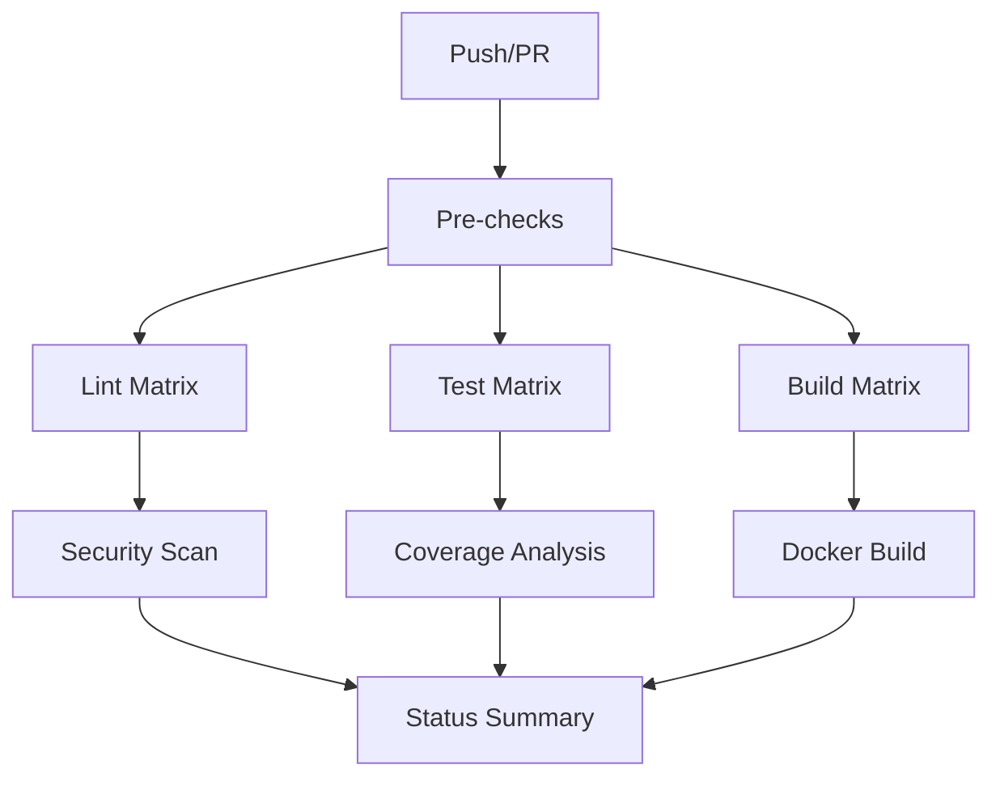

# 🚀 CI/CD Setup Documentation

## Overview

This project implements a comprehensive CI/CD pipeline with **enterprise-grade quality gates** and **automated quality enforcement**. The setup consists of multiple GitHub Actions workflows that ensure code quality, architecture compliance, and deployment readiness.

## 📁 Workflow Files

### 1. `lint.yml` - Code Quality & Architecture Validation

- **Triggers**: Push, PR, manual dispatch
- **Purpose**: Comprehensive code quality and architecture validation
- **Features**:
  - Multi-version Go support (1.21, 1.22, 1.23, 1.24)
  - golangci-lint with maximum strictness configuration
  - go-arch-lint for Clean Architecture enforcement
  - Security scanning with gosec + vulnerability detection
  - Template generation verification
  - Build verification across all Go versions
  - Detailed reporting and artifact uploads

### 2. `test.yml` - Testing Suite

- **Triggers**: Push, PR, manual dispatch
- **Purpose**: Comprehensive testing with coverage analysis
- **Features**:
  - Unit tests across all Go versions
  - Race condition detection
  - Integration and end-to-end tests
  - Benchmark performance testing
  - Coverage analysis with 80% threshold
  - Codecov integration preparation
  - Configuration testing
  - Multi-run race detection for reliability

### 3. `ci.yml` - Complete CI Pipeline

- **Triggers**: Push, PR, manual dispatch
- **Purpose**: Orchestrated CI/CD with build verification
- **Features**:
  - Multi-platform builds (Ubuntu, Windows, macOS)
  - Multi-version Go support
  - Docker build verification
  - Dependency vulnerability scanning
  - Performance baseline establishment
  - Executable generation and verification
  - Complete integration testing

### 4. `status.yml` - Status Dashboard

- **Triggers**: Workflow completion, daily schedule, manual
- **Purpose**: Project health monitoring and status reporting
- **Features**:
  - Overall project health summary
  - Quick health checks
  - Status badge information generation
  - Daily health monitoring

## 🔧 Tool Integration

### Core Linting Tools

- **golangci-lint v2.3.1**: Maximum strictness code quality
- **go-arch-lint v1.12.0**: Clean Architecture boundary enforcement
- **templ**: Type-safe HTML template generation
- **just**: Command automation and consistency

### Testing Framework

- **Ginkgo/Gomega**: BDD testing (as configured in project)
- **Go testing**: Standard Go testing with race detection
- **Coverage analysis**: Atomic coverage mode with HTML reports

### Build Tools

- **Go 1.21-1.24**: Multi-version compatibility testing
- **Docker**: Container build verification
- **Cross-platform**: Ubuntu, Windows, macOS support

## 📊 Quality Gates

### Code Quality Requirements

- ✅ Zero linting violations (golangci-lint)
- ✅ Architecture boundaries enforced (go-arch-lint)
- ✅ No security vulnerabilities (gosec + govulncheck)
- ✅ No race conditions detected
- ✅ Function length ≤ 50 lines
- ✅ Cyclomatic complexity ≤ 10
- ✅ No `interface{}`, `any`, or `panic()` usage

### Testing Requirements

- ✅ 80% minimum test coverage
- ✅ All tests pass across Go versions
- ✅ Race condition detection clean
- ✅ Integration tests pass
- ✅ Benchmarks establish performance baseline

### Build Requirements

- ✅ Builds successfully on all platforms
- ✅ Templates generate without errors
- ✅ Executables run and respond to health checks
- ✅ Docker images build and start correctly
- ✅ Dependencies verified and vulnerability-free

## 🚀 Workflow Execution Strategy

### Parallel Execution



### Matrix Strategies

- **Go Versions**: 1.21, 1.22, 1.23, 1.24
- **Platforms**: Ubuntu, Windows, macOS
- **Test Types**: Unit, Integration, Race, Benchmarks

### Fail-Fast Strategy

- Pre-checks fail fast on basic issues
- Matrix jobs continue even if some versions fail
- Final success gates require all critical jobs to pass

## 📈 Performance Optimizations

### Caching Strategy

- Go module cache shared across workflows
- Tool installations cached per workflow
- Dependency downloads optimized

### Resource Management

- Appropriate timeouts for each job type
- Concurrent job limits to prevent resource exhaustion
- Artifact retention optimized (30 days)

### Efficiency Features

- Quick pre-flight checks to fail early
- Parallel execution where possible
- Conditional steps based on Go version/platform
- Smart artifact uploading (only on specific versions)

## 🔐 Security Features

### Vulnerability Scanning

- `govulncheck` for Go-specific vulnerabilities
- `gosec` for security best practices
- Dependency tree analysis
- Container security (when Docker is used)

### Secret Management

- Codecov token support (when configured)
- No hardcoded secrets in workflows
- Secure artifact handling

## 📦 Artifact Management

### Generated Artifacts

- **Lint Reports**: JSON, XML, HTML formats
- **Coverage Reports**: HTML and text summaries
- **Benchmark Results**: Performance baselines
- **Dependency Analysis**: Graph and listing
- **Build Artifacts**: Cross-platform executables

### Retention Policy

- 30 days for all artifacts
- Automatic cleanup prevents storage bloat
- Critical reports always preserved

## 🔄 Integration with Project

### Justfile Integration

The workflows extensively use the project's `justfile` commands:

- `just install`: Tool installation
- `just lint`: Complete linting suite
- `just test`: Test execution with coverage
- `just build`: Template generation and building
- `just fix`: Auto-formatting and fixes

### Configuration Files

- `.golangci.yml`: Maximum strictness linting rules
- `.go-arch-lint.yml`: Clean Architecture enforcement
- `go.mod`: Dependency and version management

## 🎯 Usage Instructions

### For Developers

```bash
# Run same checks locally as CI
just install  # Install all tools
just lint     # Run all linting
just test     # Run tests with coverage
just build    # Build and verify
```

### For Repository Setup

1. Ensure all configuration files are present
2. Add repository secrets if using external services:
   - `CODECOV_TOKEN` (optional): For coverage reporting
3. Workflows will automatically run on push/PR

### For Customization

- **Go Versions**: Update matrix in workflow files
- **Coverage Threshold**: Modify `COVERAGE_THRESHOLD` in test.yml
- **Tool Versions**: Update in workflow env sections
- **Quality Rules**: Modify .golangci.yml and .go-arch-lint.yml

## 🏆 Best Practices Implemented

### GitHub Actions Best Practices

- ✅ Concurrency control to prevent resource waste
- ✅ Proper timeout management
- ✅ Descriptive job and step names with emojis
- ✅ Conditional execution based on context
- ✅ Secure secret handling
- ✅ Efficient caching strategies

### Go Development Best Practices

- ✅ Multi-version compatibility testing
- ✅ Race condition detection
- ✅ Cross-platform build verification
- ✅ Dependency vulnerability scanning
- ✅ Performance regression monitoring
- ✅ Code quality enforcement

### CI/CD Pipeline Best Practices

- ✅ Fail-fast on basic issues
- ✅ Parallel execution for efficiency
- ✅ Comprehensive reporting
- ✅ Artifact preservation
- ✅ Status monitoring and health checks

## 🚀 Ready for Production

This CI/CD setup provides enterprise-grade quality assurance suitable for production environments. It enforces architectural boundaries, maintains code quality, ensures security, and provides comprehensive testing coverage.

The configuration is designed to be **copied and adapted** to other Go projects, providing a solid foundation for maintaining high-quality codebases.
