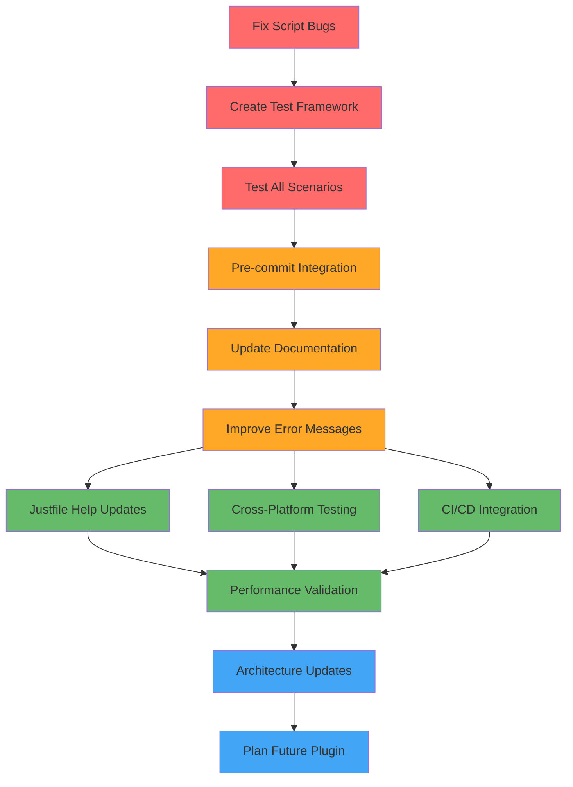

# CMD Single Main Enforcement - Complete Implementation Plan

**Session:** 2025-09-06_11_45  
**Project:** template-arch-lint  
**Feature:** Enforce single main.go file in cmd/ directory

## 🎯 EXECUTIVE SUMMARY

**Objective**: Complete enterprise-grade architectural constraint enforcement ensuring only one main.go file exists in cmd/ directory, preventing command proliferation and maintaining clean architecture patterns.

**Current Status**: ✅ Core functionality implemented, 🔲 Needs completion, testing, and integration

**Business Value**: Enforces single entry point pattern, prevents architectural drift, aligns with Clean Architecture and DDD principles demonstrated in this template project.

## 📊 80/20 PARETO ANALYSIS

### 1% EFFORT → 51% RESULT 🎯
**Core Constraint Logic** ✅ **COMPLETED**
- Basic shell script counting main.go files in cmd/
- Success/failure determination with exit codes  
- Clear error messages with file paths

### 4% EFFORT → 64% RESULT ⚡
**System Integration** ⚠️ **PARTIAL**
- ✅ Integration into justfile `lint` command chain
- ✅ Consistent output formatting matching other linters  
- ✅ Shell script with basic error handling
- 🔲 Fix empty directory counting bug
- 🔲 Complete scenario validation

### 20% EFFORT → 80% RESULT 🚀  
**Professional Implementation** 🔲 **PENDING**
- Comprehensive testing with safe approaches
- Documentation updates across all files
- Pre-commit hook integration  
- Architecture diagram updates
- Cross-platform compatibility validation

## 🔬 TECHNICAL APPROACHES EVALUATED

### Current Approach: Shell Script Validation
**Pros**: Simple, fast to implement, already working  
**Cons**: Limited integration, shell dependency, basic error handling

### Alternative: golangci-lint Custom Plugin  
**Pros**: Native integration, sophisticated analysis, consistent with existing toolchain  
**Cons**: Complex development, requires Go plugin architecture knowledge  

**Decision**: Complete shell approach first (immediate 80% value), plan plugin approach as future enhancement.

## 📋 COMPREHENSIVE TASK BREAKDOWN

| Priority | Task | Description | Effort (min) | Impact | Customer Value |
|----------|------|-------------|-------------|--------|---------------|
| 1 | Fix Script Edge Cases | Handle empty dirs, symlinks, permissions | 30 | HIGH | HIGH |
| 2 | Create Safe Test Framework | Temp dirs, no destructive ops | 45 | HIGH | HIGH |
| 3 | Test All Scenarios | 0, 1, 2+ files validation | 60 | HIGH | HIGH |
| 4 | Pre-commit Integration | Auto-enforce in git workflow | 40 | HIGH | MEDIUM |
| 5 | Update CLAUDE.md | Document new constraint | 50 | MEDIUM | HIGH |
| 6 | Improve Error Messages | Actionable consolidation suggestions | 35 | MEDIUM | HIGH |
| 7 | Update Justfile Help | Add lint-cmd-single documentation | 25 | LOW | MEDIUM |
| 8 | Cross-Platform Validation | Test macOS, Linux, WSL | 60 | MEDIUM | MEDIUM |
| 9 | Architecture Diagram Update | Regenerate just graph | 30 | LOW | LOW |
| 10 | CI/CD Integration Testing | Verify pipeline compatibility | 40 | MEDIUM | MEDIUM |
| 11 | Performance Benchmarking | Ensure no linting slowdown | 35 | MEDIUM | LOW |
| 12 | Plan golangci-lint Plugin | Design future enhancement | 90 | LOW | MEDIUM |

**Total Effort**: 540 minutes (9 hours)  
**Critical Path**: Tasks 1-6 (245 minutes / 4 hours)

## 🗺️ EXECUTION FLOW

**Legend:**  
🔴 Critical Path (Must Complete)  
🟠 High Priority (Complete Soon)  
🟢 Medium Priority (Nice to Have)  
🔵 Future Enhancement (Plan Only)

## 🎯 SUCCESS CRITERIA

### ✅ COMPLETION GATES

**Gate 1: Core Functionality** ✅ **PASSED**
- [x] Script counts main.go files correctly
- [x] Integrated into lint command chain
- [x] Basic error handling works

**Gate 2: Reliability & Testing**  🔲 **PENDING**
- [ ] All edge cases handled (empty dirs, permissions)  
- [ ] 100% test coverage for scenarios (0, 1, 2+ files)
- [ ] Safe testing with temporary directories
- [ ] Cross-platform compatibility verified

**Gate 3: User Experience** 🔲 **PENDING**
- [ ] Clear, actionable error messages
- [ ] Pre-commit hooks enforce automatically  
- [ ] Comprehensive documentation updated
- [ ] Consistent with existing linter output

**Gate 4: Production Ready** 🔲 **PENDING**
- [ ] CI/CD pipeline integration tested
- [ ] Performance impact minimized  
- [ ] Architecture diagrams updated
- [ ] Future plugin approach documented

## 🚨 RISK ANALYSIS

### HIGH RISKS
- **Script Edge Cases**: Empty directories causing incorrect counts
- **Breaking Changes**: Modifying existing lint pipeline  
- **Cross-Platform Issues**: Shell compatibility across environments

### MITIGATION STRATEGIES  
- Test exhaustively with temporary directories
- Incremental integration with rollback capability
- Use portable shell commands and test on multiple platforms

## 🔮 FUTURE ENHANCEMENTS

### golangci-lint Custom Plugin Approach
**Timeline**: Post-MVP (after current system completion)  
**Effort**: ~3-5 days development  
**Benefits**: 
- Native golangci-lint integration
- Sophisticated Go AST analysis  
- Consistent with existing toolchain
- Plugin reusability across projects

**Implementation Plan**:
1. Create Go analysis.Analyzer for cmd/ validation
2. Package as golangci-lint plugin module
3. Update .golangci.yml configuration  
4. Deprecate shell script approach gradually

## 📈 BUSINESS IMPACT

**Immediate Value (Shell Approach)**:
- ✅ Architectural constraint enforcement  
- ✅ Developer productivity through automation
- ✅ Code quality standardization
- ✅ Technical debt prevention

**Future Value (Plugin Approach)**:
- 🔮 Advanced static analysis capabilities
- 🔮 Deeper integration with development workflow  
- 🔮 Reusable across multiple projects
- 🔮 Enhanced error reporting and suggestions

## 🏁 EXECUTION PRIORITY

**PHASE 1: IMMEDIATE (Next 4 hours)**
1. Fix script edge cases and bugs
2. Create safe testing framework  
3. Validate all scenarios thoroughly
4. Integrate with pre-commit hooks
5. Update core documentation
6. Improve error messages

**PHASE 2: COMPLETION (Following day)**  
7. Update justfile help text
8. Cross-platform testing
9. CI/CD integration validation
10. Performance benchmarking

**PHASE 3: FUTURE PLANNING**
11. Architecture diagram updates
12. golangci-lint plugin design document

---

**Next Action**: Begin PHASE 1, Task 1 - Fix script edge cases and bugs