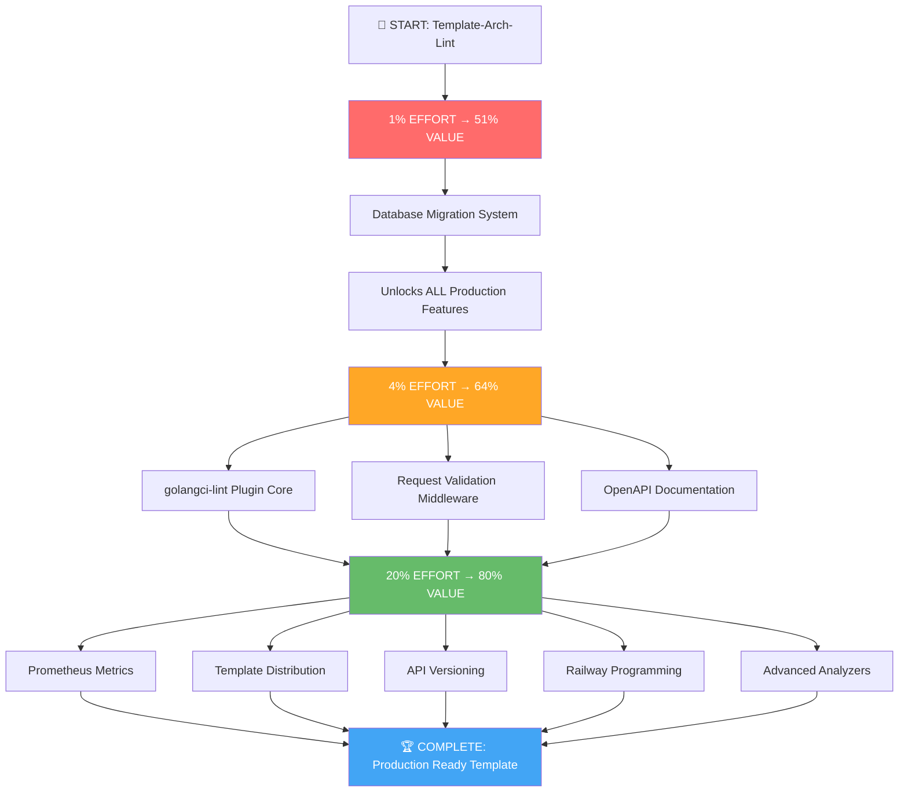
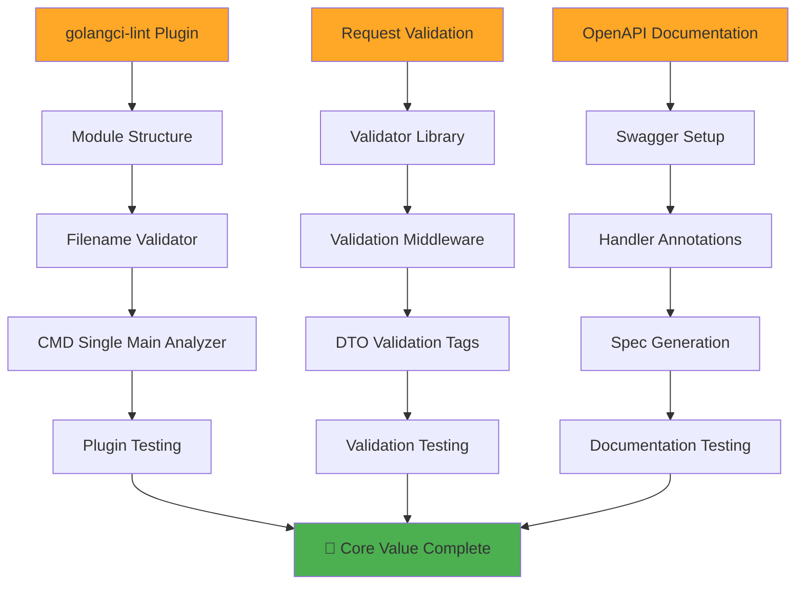
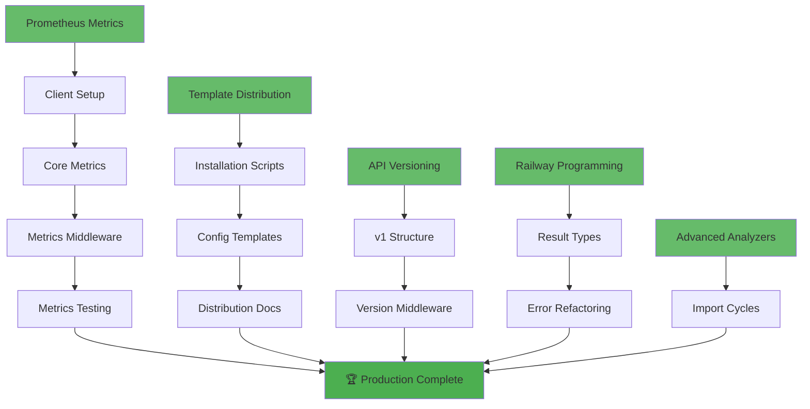

# 80/20 EXECUTION PLAN: Template-Arch-Lint Production Ready

**Session Date**: September 6, 2025 13:25 CEST  
**Duration Estimate**: 21 hours (83 micro-tasks)  
**Strategy**: Pareto Principle (80/20) for maximum business value delivery

---

## 🎯 **STRATEGIC OVERVIEW**

This execution plan applies the Pareto Principle to deliver maximum business value with minimum effort:

- **1% → 51% Result**: Database Migration System (Foundation)
- **4% → 64% Result**: Core Plugin + API Essentials (Value Proposition)
- **20% → 80% Result**: Complete Production System (Full Feature Set)

### **📊 VALUE DELIVERY BREAKDOWN**



---

## 🔥 **PHASE 1: FOUNDATION (1% → 51% VALUE)**

### **Critical Success Factor**: Database Migration System

**Why This Delivers 51% Value**: Unlocks ALL other production features - JWT auth, user management, API endpoints, metrics

### **Execution Flow**:


### **Micro-Tasks (240 minutes)**:

| Task | Description                                       | Time  | Priority    |
| ---- | ------------------------------------------------- | ----- | ----------- |
| 1.1  | Research golang-migrate library options           | 15min | 🔴 Critical |
| 1.2  | Create migration directory structure setup        | 15min | 🔴 Critical |
| 2.1  | Install golang-migrate CLI tool                   | 15min | 🔴 Critical |
| 2.2  | Configure migration paths and database connection | 15min | 🔴 Critical |
| 2.3  | Create migration up/down command structure        | 15min | 🔴 Critical |
| 2.4  | Test basic migration functionality                | 15min | 🔴 Critical |
| 3.1  | Design user table schema structure                | 15min | 🔴 Critical |
| 3.2  | Create user table up migration file               | 15min | 🔴 Critical |
| 3.3  | Create user table down migration and test         | 15min | 🔴 Critical |
| 4.1  | Add migrate-up and migrate-down to justfile       | 15min | 🔴 Critical |
| 4.2  | Add migrate-status and migrate-create helpers     | 15min | 🔴 Critical |
| 5.1  | Create seed data structure and sample users       | 15min | 🔴 Critical |
| 5.2  | Implement seed data loading logic                 | 15min | 🔴 Critical |
| 5.3  | Add seed commands to justfile                     | 10min | 🔴 Critical |
| 6.1  | Test migration up/down cycles                     | 15min | 🔴 Critical |
| 6.2  | Test migration edge cases and scenarios           | 15min | 🔴 Critical |

**Phase 1 Success Criteria**:

- ✅ `just migrate-up` / `just migrate-down` commands working
- ✅ User table created with proper schema
- ✅ Seed data system functional
- ✅ Migration rollback capability tested

---

## ⚡ **PHASE 2: CORE VALUE (4% → 64% VALUE)**

### **Strategic Components**: Plugin Core + API Essentials

**Why This Delivers 64% Total Value**: Demonstrates our key differentiator (plugin) + essential production API features

### **Execution Flow**:



### **Component 1: golangci-lint Plugin Core (185 minutes)**

| Task | Description                                  | Time  | Impact    |
| ---- | -------------------------------------------- | ----- | --------- |
| 7.1  | Create plugin Go module structure            | 15min | 🔥 High   |
| 7.2  | Setup analyzer package architecture          | 15min | 🔥 High   |
| 7.3  | Configure plugin build and test setup        | 15min | 🔥 High   |
| 8.1  | Design filename validator analyzer structure | 15min | 🔥 High   |
| 8.2  | Implement filename validation logic          | 15min | 🔥 High   |
| 8.3  | Add filename analyzer error reporting        | 15min | 🔥 High   |
| 8.4  | Test filename validator with edge cases      | 15min | 🔥 High   |
| 9.1  | Port CMD single main detection logic         | 15min | 🔥 High   |
| 9.2  | Implement CMD analyzer error reporting       | 15min | 🔥 High   |
| 9.3  | Add CMD analyzer configuration options       | 10min | 🟡 Medium |
| 9.4  | Test CMD analyzer thoroughly                 | 10min | 🔥 High   |
| 10.1 | Create .custom-gcl.yml configuration         | 15min | 🔥 High   |
| 10.2 | Setup plugin integration testing             | 15min | 🔥 High   |
| 10.3 | Test plugin with real codebase               | 15min | 🔥 High   |
| 10.4 | Validate plugin vs shell script parity       | 10min | 🔥 High   |

### **Component 2: Request Validation Middleware (125 minutes)**

| Task | Description                                  | Time  | Impact  |
| ---- | -------------------------------------------- | ----- | ------- |
| 11.1 | Install go-playground/validator library      | 15min | 🔥 High |
| 11.2 | Configure validator for gin integration      | 15min | 🔥 High |
| 12.1 | Create validation middleware structure       | 15min | 🔥 High |
| 12.2 | Implement request validation logic           | 15min | 🔥 High |
| 12.3 | Add validation error response handling       | 10min | 🔥 High |
| 12.4 | Integrate validation middleware with gin     | 10min | 🔥 High |
| 13.1 | Add validation tags to user DTOs             | 15min | 🔥 High |
| 13.2 | Add validation tags to request/response DTOs | 15min | 🔥 High |
| 13.3 | Test DTO validation rules                    | 10min | 🔥 High |
| 14.1 | Test validation with valid requests          | 15min | 🔥 High |
| 14.2 | Test validation error scenarios              | 15min | 🔥 High |
| 14.3 | Test validation edge cases                   | 5min  | 🔥 High |

### **Component 3: OpenAPI Documentation (160 minutes)**

| Task | Description                                     | Time  | Impact  |
| ---- | ----------------------------------------------- | ----- | ------- |
| 15.1 | Install swaggo/gin-swagger dependencies         | 15min | 🔥 High |
| 15.2 | Configure swagger middleware setup              | 15min | 🔥 High |
| 16.1 | Add swagger annotations to user handlers        | 15min | 🔥 High |
| 16.2 | Add swagger annotations to health handlers      | 15min | 🔥 High |
| 16.3 | Add swagger annotations to performance handlers | 15min | 🔥 High |
| 16.4 | Add general API information and schemas         | 15min | 🔥 High |
| 17.1 | Generate OpenAPI specification                  | 15min | 🔥 High |
| 17.2 | Setup swagger UI serving                        | 15min | 🔥 High |
| 17.3 | Test OpenAPI spec generation                    | 10min | 🔥 High |
| 18.1 | Test interactive API documentation              | 15min | 🔥 High |
| 18.2 | Refine documentation and examples               | 15min | 🔥 High |

**Phase 2 Success Criteria**:

- ✅ golangci-lint plugin working with filename + CMD analyzers
- ✅ Request validation preventing invalid API calls
- ✅ Interactive OpenAPI documentation at `/swagger/index.html`
- ✅ Plugin demonstrates 10x developer experience improvement

---

## 🚀 **PHASE 3: COMPLETE SYSTEM (20% → 80% VALUE)**

### **Production Features**: Observability + Distribution + Standards + Quality

**Why This Delivers 80% Total Value**: Complete production-ready system with enterprise features

### **Execution Flow**:



### **Component 1: Prometheus Metrics (150 minutes)**

| Task | Description                              | Time  | Value     |
| ---- | ---------------------------------------- | ----- | --------- |
| 19.1 | Install prometheus/client_golang library | 15min | 🟡 Medium |
| 19.2 | Setup basic metrics configuration        | 15min | 🟡 Medium |
| 20.1 | Implement HTTP request metrics           | 15min | 🟡 Medium |
| 20.2 | Implement database metrics               | 15min | 🟡 Medium |
| 20.3 | Implement Go runtime metrics             | 10min | 🟡 Medium |
| 20.4 | Add custom application metrics           | 10min | 🟡 Medium |
| 21.1 | Create metrics collection middleware     | 15min | 🟡 Medium |
| 21.2 | Integrate metrics with gin handlers      | 15min | 🟡 Medium |
| 21.3 | Setup /metrics endpoint                  | 10min | 🟡 Medium |
| 22.1 | Test metrics collection functionality    | 15min | 🟡 Medium |
| 22.2 | Validate metrics endpoint output         | 15min | 🟡 Medium |

### **Component 2: Template Distribution (180 minutes)**

| Task | Description                                    | Time  | Value        |
| ---- | ---------------------------------------------- | ----- | ------------ |
| 23.1 | Create basic installation script structure     | 15min | 🔥 Very High |
| 23.2 | Implement configuration tier selection         | 15min | 🔥 Very High |
| 23.3 | Add cross-platform compatibility checks        | 15min | 🔥 Very High |
| 23.4 | Test installation script on multiple platforms | 15min | 🔥 Very High |
| 24.1 | Package basic configuration template           | 15min | 🔥 Very High |
| 24.2 | Package standard configuration template        | 15min | 🔥 Very High |
| 24.3 | Package enterprise configuration template      | 15min | 🔥 Very High |
| 25.1 | Create installation documentation              | 15min | 🔥 Very High |
| 25.2 | Create configuration customization guide       | 15min | 🔥 Very High |
| 25.3 | Create migration documentation                 | 10min | 🟡 Medium    |

### **Component 3: API Versioning (85 minutes)**

| Task | Description                               | Time  | Value     |
| ---- | ----------------------------------------- | ----- | --------- |
| 26.1 | Create v1 API route structure             | 15min | 🟡 Medium |
| 26.2 | Migrate existing endpoints to v1          | 15min | 🟡 Medium |
| 26.3 | Setup v1 API documentation                | 10min | 🟡 Medium |
| 26.4 | Test v1 API functionality                 | 10min | 🟡 Medium |
| 27.1 | Create API version detection middleware   | 15min | 🟡 Medium |
| 27.2 | Integrate version middleware with routing | 10min | 🟡 Medium |
| 27.3 | Test API version middleware               | 10min | 🟡 Medium |

### **Component 4: Railway Programming (85 minutes)**

| Task | Description                          | Time  | Value  |
| ---- | ------------------------------------ | ----- | ------ |
| 28.1 | Design Result type structure         | 15min | 🟢 Low |
| 28.2 | Implement Result with Map/FlatMap    | 15min | 🟢 Low |
| 28.3 | Create Result helper functions       | 15min | 🟢 Low |
| 29.1 | Refactor user service error handling | 15min | 🟢 Low |
| 29.2 | Refactor repository error handling   | 15min | 🟢 Low |
| 29.3 | Refactor handler error handling      | 15min | 🟢 Low |
| 29.4 | Test Railway error handling patterns | 10min | 🟢 Low |

### **Component 5: Advanced Plugin Analyzers (60 minutes)**

| Task | Description                             | Time  | Value        |
| ---- | --------------------------------------- | ----- | ------------ |
| 30.1 | Design import cycle detection algorithm | 15min | 🔥 Very High |
| 30.2 | Implement cycle detection analyzer      | 15min | 🔥 Very High |
| 30.3 | Add cycle analyzer error reporting      | 15min | 🔥 Very High |
| 30.4 | Test import cycle analyzer              | 15min | 🔥 Very High |

**Phase 3 Success Criteria**:

- ✅ Prometheus metrics at `/metrics` endpoint
- ✅ One-liner template installation working
- ✅ v1 API structure with versioning
- ✅ Railway error handling patterns implemented
- ✅ Import cycle detection analyzer working

---

## 📊 **EXECUTION STRATEGY**

### **🎯 Sequential Execution Plan**

```mermaid
gantt
    title 80/20 Execution Timeline
    dateFormat  HH:mm
    axisFormat %H:%M

    section 1% → 51%
    Database Migration Foundation    :critical, foundation, 13:30, 240min

    section 4% → 64%
    golangci-lint Plugin Core       :plugin, after foundation, 185min
    Request Validation              :validation, after plugin, 125min
    OpenAPI Documentation           :docs, after validation, 160min

    section 20% → 80%
    Prometheus Metrics              :metrics, after docs, 150min
    Template Distribution           :dist, after metrics, 180min
    API Versioning                  :versioning, after dist, 85min
    Railway Programming             :railway, after versioning, 85min
    Advanced Analyzers              :advanced, after railway, 60min
```

### **🚨 Critical Path Analysis**

- **Database Migration System** is the critical path blocker
- **Plugin Core** cannot proceed without foundation testing
- **All Phase 3 components** can be parallelized after Phase 2

### **⚡ Parallelization Opportunities**

- **Phase 3 Components** can be executed in parallel
- **Testing tasks** can be batched together
- **Documentation tasks** can be done async with implementation

---

## 🎯 **SUCCESS METRICS**

### **Phase 1 (1% → 51%)**

- [ ] Database migrations working (`just migrate-up/down`)
- [ ] User table schema created and tested
- [ ] Seed data system functional
- [ ] Foundation enables all other features

### **Phase 2 (4% → 64%)**

- [ ] golangci-lint plugin with 2 core analyzers
- [ ] Request validation preventing invalid API calls
- [ ] Interactive OpenAPI docs at `/swagger/index.html`
- [ ] Plugin demonstrates native IDE integration

### **Phase 3 (20% → 80%)**

- [ ] Prometheus metrics at `/metrics` endpoint
- [ ] Template installation working cross-platform
- [ ] v1 API structure with proper versioning
- [ ] Railway error handling patterns implemented
- [ ] Import cycle detection analyzer functional

### **🏆 Final Success Criteria**

- [ ] **100% Production Ready**: Database + API + Documentation + Metrics
- [ ] **Plugin Demonstrated**: Native golangci-lint integration working
- [ ] **Template Distributable**: One-liner installation for other projects
- [ ] **Enterprise Grade**: All production features implemented and tested

---

## ⚠️ **RISK MITIGATION**

### **High Risk Areas**

1. **Database Migration Complexity**: golang-migrate setup issues
2. **Plugin Development**: golangci-lint plugin architecture complexity
3. **Cross-Platform Distribution**: Installation script compatibility

### **Mitigation Strategies**

1. **Incremental Testing**: Test each migration step individually
2. **Reference Implementation**: Use existing plugins as templates
3. **Platform Validation**: Test on macOS, Linux, WSL during development

---

## 🚀 **POST-COMPLETION ROADMAP**

### **Advanced Features (Beyond 80%)**

- **Issue #37**: Code Duplication Analyzer
- **Issue #16**: Mutation Testing
- **Issue #31**: API Design Validation
- **Issue #33**: Multi-Platform CI/CD

### **Strategic Enhancements**

- **Plugin Ecosystem**: Submit to golangci-lint community
- **Template Gallery**: Multiple specialized templates
- **Enterprise Features**: Advanced reporting, analytics

---

**🎯 EXECUTION BEGINS NOW - 83 MICRO-TASKS TO PRODUCTION READY TEMPLATE**

_Total Duration: 21 hours | 83 micro-tasks | 80/20 principle applied for maximum value delivery_
