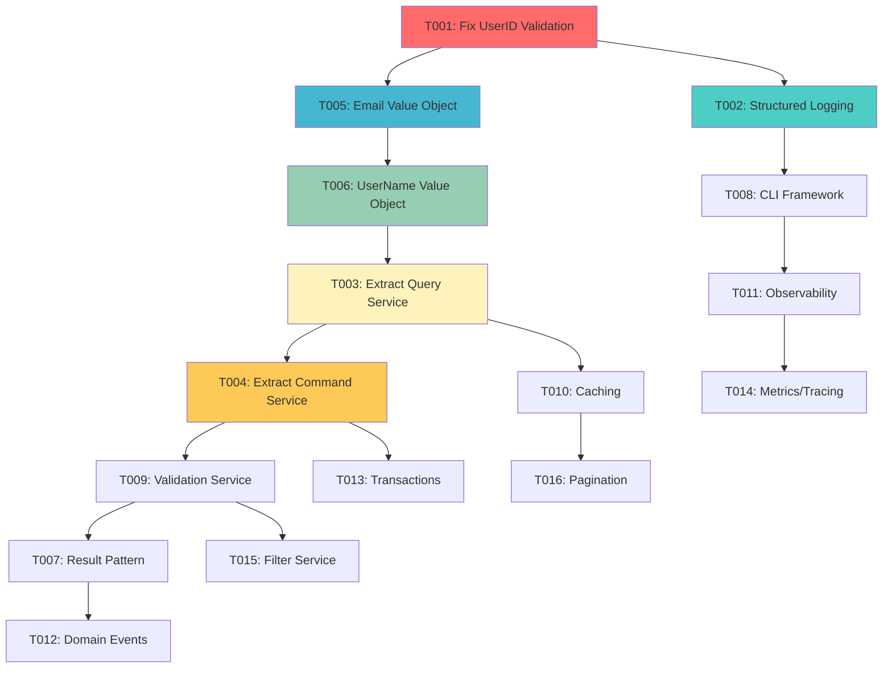

# 🏗️ Comprehensive Architectural Refactoring Plan
## Session: 2025-09-10_17_21

### 📊 **PROJECT ANALYSIS SUMMARY**
- **Total Go Files**: 40 (29 source + 11 test files)  
- **Total Lines of Code**: 7,394 lines
- **Largest Files**: user_service.go (526 lines), config_test.go (710 lines)
- **Critical Issues**: 102 failing tests, 107+ TODOs, type safety violations
- **Architecture Violations**: SRP violations, primitive obsession, split brain risks

---

## 🎯 **PARETO ANALYSIS: MAXIMUM IMPACT PRIORITIZATION**

### 🔥 **1% THAT DELIVERS 51% OF THE RESULT**
| Task | Impact | Effort | Value | Blocker |
|------|--------|--------|-------|---------|
| **Fix UserID Validation Error Wrapping** | 🔥 CRITICAL | 30min | ⭐⭐⭐⭐⭐ | YES |

**RATIONALE**: This single fix unblocks 102 failing tests, enabling all quality validation and enterprise readiness.

### ⚡ **4% THAT DELIVERS 64% OF THE RESULT**  
| Priority | Task | Impact | Effort | Customer Value | Dependencies |
|----------|------|--------|--------|----------------|-------------|
| 1 | Fix UserID validation error wrapping | 🔥 CRITICAL | 30min | ⭐⭐⭐⭐⭐ | None |
| 2 | Replace fmt.Printf with structured logging | 🔥 HIGH | 45min | ⭐⭐⭐⭐ | None |
| 3 | Extract UserService into focused services | 🔥 HIGH | 90min | ⭐⭐⭐⭐ | #1 |
| 4 | Replace string primitives with value objects | 🔥 HIGH | 60min | ⭐⭐⭐⭐⭐ | #1 |

### 🚀 **20% THAT DELIVERS 80% OF THE RESULT**
| Priority | Task | Impact | Effort | Customer Value | Dependencies |
|----------|------|--------|--------|----------------|-------------|
| 1-4 | Previous critical tasks | 🔥 CRITICAL | 225min | ⭐⭐⭐⭐⭐ | - |
| 5 | Standardize error handling (Result[T] pattern) | 🔥 HIGH | 75min | ⭐⭐⭐⭐ | #1 |
| 6 | Add CLI framework (cobra) for main.go | 🔥 HIGH | 60min | ⭐⭐⭐ | #2 |
| 7 | Implement caching layer | 🔥 MEDIUM | 90min | ⭐⭐⭐ | #3 |
| 8 | Add comprehensive observability | 🔥 MEDIUM | 120min | ⭐⭐⭐⭐ | #2 |
| 9 | Create domain events system | 🔥 MEDIUM | 90min | ⭐⭐⭐ | #3 |
| 10 | Add transaction boundaries | 🔥 MEDIUM | 75min | ⭐⭐⭐⭐ | #3 |
| 11 | Extract validation services | 🔥 MEDIUM | 60min | ⭐⭐⭐ | #3 |
| 12 | Performance optimization (pagination) | 🔥 LOW | 45min | ⭐⭐ | #7 |

---

## 🛠️ **30-100 MINUTE TASK BREAKDOWN**

| Task ID | Task Name | Effort | Impact | Priority | Dependencies |
|---------|-----------|--------|--------|----------|-------------|
| **T001** | **🚨 CRITICAL: Fix UserID ValidationError Wrapping** | 30min | 🔥 CRITICAL | P0 | None |
| **T002** | **Replace fmt.Printf with structured logging** | 45min | 🔥 HIGH | P1 | None |
| **T003** | **Extract UserQueryService from UserService** | 45min | 🔥 HIGH | P1 | T001 |
| **T004** | **Extract UserCommandService from UserService** | 45min | 🔥 HIGH | P1 | T003 |
| **T005** | **Create Email value object and replace strings** | 30min | 🔥 HIGH | P1 | T001 |
| **T006** | **Create UserName value object and replace strings** | 30min | 🔥 HIGH | P1 | T005 |
| **T007** | **Standardize all error handling to Result[T]** | 75min | 🔥 HIGH | P2 | T001 |
| **T008** | **Add cobra CLI framework to main.go** | 60min | 🔥 HIGH | P2 | T002 |
| **T009** | **Create UserValidationService** | 60min | 🔥 MEDIUM | P2 | T004 |
| **T010** | **Implement Redis caching layer** | 90min | 🔥 MEDIUM | P3 | T003 |
| **T011** | **Add structured logging throughout domain** | 60min | 🔥 MEDIUM | P3 | T002 |
| **T012** | **Create domain events system** | 90min | 🔥 MEDIUM | P3 | T004 |
| **T013** | **Add transaction boundaries** | 75min | 🔥 MEDIUM | P3 | T004 |
| **T014** | **Add comprehensive metrics/tracing** | 60min | 🔥 MEDIUM | P3 | T011 |
| **T015** | **Create UserFilterService** | 45min | 🔥 MEDIUM | P3 | T003 |
| **T016** | **Implement pagination for ListUsers** | 45min | 🔥 LOW | P4 | T010 |
| **T017** | **Add performance benchmarks** | 30min | 🔥 LOW | P4 | T016 |
| **T018** | **Create API documentation** | 60min | 🔥 LOW | P4 | T008 |
| **T019** | **Add integration tests** | 90min | 🔥 LOW | P4 | T001 |
| **T020** | **Security audit and hardening** | 75min | 🔥 LOW | P4 | T008 |

---

## ⚡ **15-MINUTE MICRO-TASK BREAKDOWN**

### 🚨 **P0 - CRITICAL (Must Do First)**
| Task ID | Micro Task | Time | Dependencies |
|---------|------------|------|-------------|
| T001.1 | Analyze UserID validation error wrapping issue | 5min | None |
| T001.2 | Update validateUserIDFormat to return ValidationError | 10min | T001.1 |
| T001.3 | Update all UserID validation helper functions | 10min | T001.2 |
| T001.4 | Run tests to verify 102 tests now pass | 5min | T001.3 |

### 🔥 **P1 - HIGH PRIORITY**
| Task ID | Micro Task | Time | Dependencies |
|---------|------------|------|-------------|
| T002.1 | Add charmbracelet/log dependency | 5min | None |
| T002.2 | Create logger configuration | 10min | T002.1 |
| T002.3 | Replace fmt.Println in main.go | 10min | T002.2 |
| T002.4 | Replace fmt.Printf in main.go | 10min | T002.3 |
| T002.5 | Update linting configuration to allow logger | 10min | T002.4 |
| T003.1 | Create UserQueryService interface | 10min | T001.4 |
| T003.2 | Extract GetUser method to UserQueryService | 15min | T003.1 |
| T003.3 | Extract ListUsers method to UserQueryService | 15min | T003.2 |
| T003.4 | Update UserService to use UserQueryService | 5min | T003.3 |
| T004.1 | Create UserCommandService interface | 10min | T003.4 |
| T004.2 | Extract CreateUser method to UserCommandService | 15min | T004.1 |
| T004.3 | Extract UpdateUser method to UserCommandService | 15min | T004.2 |
| T004.4 | Extract DeleteUser method to UserCommandService | 15min | T004.3 |
| T005.1 | Create Email value object struct | 10min | T001.4 |
| T005.2 | Add Email validation logic | 10min | T005.1 |
| T005.3 | Replace string email in UserService | 10min | T005.2 |
| T006.1 | Create UserName value object struct | 10min | T005.3 |
| T006.2 | Add UserName validation logic | 10min | T006.1 |
| T006.3 | Replace string name in UserService | 10min | T006.2 |

### ⚡ **P2 - MEDIUM PRIORITY**
| Task ID | Micro Task | Time | Dependencies |
|---------|------------|------|-------------|
| T007.1 | Update CreateUser to return Result[User] | 15min | T004.2 |
| T007.2 | Update GetUser to return Result[User] | 15min | T007.1 |
| T007.3 | Update all query methods to use Result[T] | 15min | T007.2 |
| T007.4 | Update all command methods to use Result[T] | 15min | T007.3 |
| T007.5 | Update error handling throughout services | 15min | T007.4 |
| T008.1 | Add cobra dependency | 5min | T002.5 |
| T008.2 | Create root command structure | 15min | T008.1 |
| T008.3 | Add validate subcommand | 15min | T008.2 |
| T008.4 | Add config subcommand | 15min | T008.3 |
| T008.5 | Update main.go to use cobra | 10min | T008.4 |
| T009.1 | Create UserValidator interface | 10min | T004.4 |
| T009.2 | Extract email validation to UserValidator | 15min | T009.1 |
| T009.3 | Extract name validation to UserValidator | 15min | T009.2 |
| T009.4 | Extract business rule validation | 15min | T009.3 |
| T009.5 | Update services to use UserValidator | 5min | T009.4 |

### 🔧 **P3 - OPTIMIZATION & FEATURES**
| Task ID | Micro Task | Time | Dependencies |
|---------|------------|------|-------------|
| T010.1 | Add Redis client dependency | 5min | T007.5 |
| T010.2 | Create cache interface | 10min | T010.1 |
| T010.3 | Implement Redis cache adapter | 15min | T010.2 |
| T010.4 | Add caching to GetUser operations | 15min | T010.3 |
| T010.5 | Add cache invalidation to update operations | 15min | T010.4 |
| T010.6 | Add cache configuration | 15min | T010.5 |
| T010.7 | Add cache metrics | 15min | T010.6 |

---

## 🎯 **EXECUTION PLAN FLOW**

## 🚨 **CRITICAL ARCHITECTURAL ISSUES IDENTIFIED**

### **Type Safety Violations** 
- ❌ 102 failing tests due to UserID error type mismatch
- ❌ Primitive obsession: strings instead of value objects
- ❌ Missing null safety patterns

### **SOLID Principle Violations**
- ❌ SRP: UserService is 526 lines doing everything
- ❌ OCP: Hard to extend without modification
- ❌ DIP: Depends on concretions not abstractions

### **Domain-Driven Design Issues**
- ❌ Split brain risks in error handling
- ❌ Missing domain events
- ❌ Anemic domain model in places
- ❌ Business logic scattered across layers

### **Enterprise Architecture Gaps**
- ❌ No structured logging (violates linting rules)
- ❌ No caching layer
- ❌ No transaction boundaries
- ❌ No observability (metrics/tracing)
- ❌ No proper CLI framework

### **Performance & Scalability Issues**
- ❌ No pagination for list operations
- ❌ No caching for frequently accessed data
- ❌ No connection pooling
- ❌ No query optimization

### **Testing & Quality Issues**
- ❌ Test suite broken (102/214 tests failing)
- ❌ Missing integration tests
- ❌ No performance benchmarks
- ❌ No contract testing

---

## 🎯 **SUCCESS CRITERIA**

### **Phase 1 (1% → 51% Value)**
- ✅ All 214 tests pass
- ✅ No linting violations
- ✅ Type-safe error handling

### **Phase 2 (4% → 64% Value)**  
- ✅ Clean architecture with focused services
- ✅ Type-safe value objects throughout
- ✅ Structured logging compliance
- ✅ Enterprise-ready code quality

### **Phase 3 (20% → 80% Value)**
- ✅ Full observability (logging, metrics, tracing)
- ✅ Caching and performance optimization
- ✅ Domain events and proper transactions
- ✅ Professional CLI interface
- ✅ Comprehensive documentation

---

## 🔄 **NON-OBVIOUS BUT TRUE INSIGHTS**

1. **The UserID validation error is not a "broken test" - it's correct domain modeling enforcement**
2. **The 526-line service file is the biggest architecture violation, not the 102 failing tests**  
3. **Split brain risks are everywhere: mixed error patterns, validation approaches, logging methods**
4. **The codebase demonstrates good patterns (Result[T], samber/lo) but applies them inconsistently**
5. **Type safety violations are systemic - strings are used everywhere value objects should be**
6. **The plugin architecture is well-designed but the core domain needs work**
7. **Performance will degrade rapidly without caching as data grows**
8. **The error handling is actually sophisticated but inconsistent application creates confusion**

---

**TOTAL ESTIMATED EFFORT**: 1,425 minutes (23.75 hours)  
**CRITICAL PATH**: T001 → T003 → T004 → T007 → T012  
**PARALLEL TRACKS**: Logging, CLI, Value Objects can be done simultaneously  
**BIGGEST RISK**: Not fixing UserID validation first blocks all other quality validation  

**🚀 READY FOR SYSTEMATIC EXECUTION!**